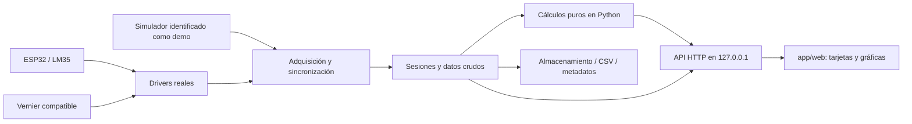

# Auditoría de arquitectura y contrato

Fecha: 2026-09-15. Rol: architect. Estado: auditoría documental terminada; implementación no iniciada en esta tarea.

## Alcance y evidencia

`pwd` confirmó `/srv/k3ds-server/data/projects/Calibracion-LM35-termopar`. La revisión inicial fue de solo lectura. Esta tarea escribe exclusivamente este archivo y `docs/aceptacion.md`; no modifica contrato, fuentes, HTML, código ni pruebas. No instala dependencias, conecta dispositivos, administra agentes ni realiza commit/push.

Se leyeron completos:

| Referencia | Archivo | Uso en la auditoría |
|---|---|---|
| C | [COORDINACION.md](../COORDINACION.md) | Fronteras, módulos, API y aceptación del MVP Windows |
| G | [goal.md](../01_Documentación/goal.md) | Rúbrica íntegra A–E y evaluación presencial |
| I | [Índice del proyecto](../01_Documentación/Calibración%20de%20LM35%20y%20termopar.md) | Jerarquía documental y estado declarado |
| M | [Cálculos y calibración del LM35](../01_Documentación/Cálculos%20y%20calibración%20del%20LM35.md) | Secciones 1–43, fórmulas y procedimiento |
| V | [Drivers Vernier Go Direct](../01_Documentación/Drivers%20Vernier%20Go%20Direct.md) | Compatibilidad, descubrimiento y pendientes |
| P | [Clinical Measurements completo](../01_Documentación/fuentes/Clinical_Measurements_completo.md) | Transcripción local de 34 páginas |
| H | [HTML original](../02_Interfaz/interfaz_calibracion_LM35_v3.html) | Diseño, contenido y JavaScript del prototipo |

El inventario inicial contenía estos siete archivos; no había backend, firmware ni pruebas. `git status --short` mostraba únicamente `?? COORDINACION.md`, situación previa que se conserva. Se auditó la transcripción disponible, no el PDF original ni las versiones actuales de los enlaces externos de V. No se afirma compatibilidad actual de bibliotecas por esta revisión.

La instrucción del usuario limita esta entrega a auditoría y dos documentos, aunque C menciona una autorización más amplia. G define el resultado académico; C define el contrato de integración. Las diferencias con M, P o H se documentan, sin cambiar unilateralmente ninguna fuente. Las propuestas siguientes requieren acordarse al cerrar el contrato; no son extensiones ya vigentes.

## Actualización por adenda concurrente — estado vigente al cierre

Durante la verificación final cambió C: SHA-256 inicial `ab9955641a2dcd931c9f924cd7dd01f6d73149b62afe7e51c39268a3ac66b33d`, posterior `eab5370b454d09e38b5b5381e93d669573f33c7b558604692ee165e783e4dd4e`. Se releyó completo. También apareció un README ajeno a esta entrega; no se modificó. Los hashes de las cinco fuentes de 01_Documentación y del HTML permanecieron iguales.

La nueva sección «Decisiones de integración tras auditoría (vigentes)» cierra parcialmente los hallazgos siguientes. **Esta actualización prevalece sobre las propuestas y el diagnóstico del contrato inicial conservados abajo.** La autorización de implementación en la adenda no amplía el encargo explícito del usuario para esta tarea.

| Hallazgos | Decisión ahora vigente | Pendiente real |
|---|---|---|
| AR-03/08/12 | Ventana de 5 s, >=5 pares, amplitud <=0.3 °C en ambos; >=5 muestras nuevas; precisión LM35; índices desde 1; máximo 20 puntos ascendentes; progreso backend | Probar el criterio operativo provisional y definir frescura/pareado; no confundirlo con exigencia docente |
| AR-05/06/07 | Adquisición activa y ventana inicial estable; prehistoria t<t0; y0 inicial/yf final; tramo final >=5 muestras y >=2 s; excursión <=max(0.3 °C,1% del cambio); cruce interpolado; curvas temporales relativas | Concretar algoritmo de selección del tramo, cambio insignificante y configuración; validar escalón real con referencia declarada identificada |
| AR-09 | Histéresis NOT_RUN en MVP sin descenso | Adquisición de ambos recorridos queda fuera del ciclo base; no bloquear MVP por ella |
| AR-10/13 | session_id; UTC inicial; dynamic/stability/static_progress en state; start/stop idempotentes; reset requiere detenido; stop aborta ensayo; fallar al guardar conserva estado | Archivo y recuperación de sesiones, errores HTTP por caso, concurrencia y demostración de durabilidad |
| AR-02/08/13 | Config parcial; modo/hardware solo detenido sin muestras; demo_target_c modificable en marcha; demo_initial_c=demo_target_c=25 inicialmente; connection enumerado; puerto 8765 | Aclarar nombre `interval` de adenda frente a `sample_interval` de API inicial: segundos, default 0.5, rango 0.1–10 ya definidos; no adoptar alias unilateralmente |
| AR-10/11 | CSV session_id,mode,t,vernier,lm35; JSON con metadatos; crudos completos y buffer visible acotado; dispositivo/canal explícitos; trama MCU JSON version=1,seq,t_ms,adc_raw,voltage_mv,status | Hardware real aún pendiente; validar sincronización, trama/estado y ADC. Conversión nominal en calculos.py no acredita calibración |

La adenda también asigna todas las decisiones matemáticas, incluyendo estabilidad, span y meseta, a auxiliares en calculos.py acordados en docs/calculos.md; builder las consume. Fija `/` desde app/web/index.html y scripts con raíz propia. Estas son decisiones contractuales actuales, no propuestas de este documento.

Persisten como bloqueos de aceptación: AR-01/02 hasta corregir y probar la interfaz, AR-04 sincronización/frescura, degeneraciones y dominio numérico de AR-08, detalles de durabilidad/errores, hardware y Windows sin ejecutar, y entregables académicos. La adenda reduce los vacíos de integración; no aporta por sí sola evidencia funcional.

## Dictamen del contrato inicial

El contrato permite separar adquisición, cálculo y presentación, pero aún no basta para aceptar una calibración reproducible. Los bloqueos principales son la definición de estabilidad y sincronización, la trazabilidad del segmento dinámico y la persistencia. El prototipo H sirve como referencia visual; sus números y fórmulas no constituyen un oráculo de aceptación.

Una demostración sintética puede verificar software. No acredita sensores, Windows, las mediciones de B/C ni los entregables D/E.

## Arquitectura prevista por C

Python 3.11+ en Windows es el objetivo. Los drivers opcionales solo manejan comunicación; `app/calculos.py` recibe datos y devuelve parámetros y series sin I/O. El frontend consulta cada 500 ms, dibuja las series recibidas y conserva rosa, tarjetas y navegación. El intervalo de consulta no define el período de adquisición. Las rutas definitivas de módulos cuya ubicación C no explicita deben documentarse antes de fijar imports.

Fronteras vigentes: researcher posee cálculos y sus pruebas; builder posee backend, adquisición, sesiones, almacenamiento, drivers y firmware; frontend posee `app/web`; architect posee revisión y aceptación. Aquí solo se describen esas responsabilidades, sin asignar ni administrar trabajo.

## Hallazgos críticos y propuestas sobre la versión inicial

| ID | Evidencia / problema | Impacto y propuesta de cierre |
|---|---|---|
| AR-01 | H, líneas 58–69: precisión/exactitud/certeza mediante `1 − std(...)` y porcentajes fijos; contradice C y M §§7–17. | Bloquea aceptación científica. Sustituir en la futura copia por media, s, s_m, RSD, CV, varianza, sigma_P e intervalos; no inventar porcentajes de exactitud o certeza. |
| AR-02 | H, líneas 36–48 y 147–164: conexiones y progreso fijos; señales generadas en JS; botones solo cambian texto; transitorio llamado experimental. | Bloquea MVP funcional y trazabilidad. Estado y series desde backend; distinguir demo, medición y respuesta derivada. Real desconectado no produce valores nuevos ni se convierte en demo. |
| AR-03 | C exige «ventana estable»; M §6 exige repeticiones; no hay duración, mínimo de muestras, umbral ni regla de antigüedad. | Bloquea `/api/point` verificable. Proponer ventana de muestras pareadas recientes, mínimo >=2, umbrales de dispersión y deriva en ambos sensores, política de no reutilización y parámetros registrados. Los valores deben justificarse con montaje/cadencia; no fijarlos como validados aquí. |
| AR-04 | C usa `{t,vernier,lm35}`; V exige timestamp y metadatos de canal; falta regla para unir lecturas de distinta cadencia. | Puede crear pares falsamente simultáneos. Proponer reloj monotónico en segundos, timestamps por origen, máximo desfase/antigüedad y descarte explícito de pares inválidos. Conservar crudos y causa del descarte. |
| AR-05 | `/api/dynamic/start` marca t0 pero state no describe ensayo activo, x0/xf, prehistoria ni fin; la firma de cálculo recibe solo t,y,x0,xf. | No se puede probar la entrada escalón ni reconstruir y0 sin decisiones adicionales. Proponer conservar ventana previa estable, t0 y segmento, extremos de entrada declarados y observados por Vernier. El backend valida entrada; cálculo identifica salida. Mostrar t0 y estado del ensayo mediante una extensión acordada. |
| AR-06 | C exige meseta y cruce, sin algoritmo; M §§30/36 y P p.30 usan 0.637; C exige `1-exp(-1)`. | Mantener regla contractual exacta ≈0.63212056 y nota visible del 63.7% de la fuente. Definir ventanas inicial/final, tolerancias, interpolación del cruce y rechazo de registros insuficientes. No confundir tau con tiempo absoluto. |
| AR-07 | M §§29/31 pasa de modelo absoluto sin offset a K incremental; puede haber b !=0. | Para C usar Δy=y−y0, Δx=x−x0 y `tau*dΔy/dt + Δy = K*Δx`. La salida reconstruida es `yf+(y0−yf)*exp(−(t−t0)/tau)`. No imponer y0=K*x0 ni yf=K*xf con offset. |
| AR-08 | C no precisa degeneraciones estáticas, tipos internos de `precision`, dominio de K ni unidades de config. | Proponer rechazo de longitudes distintas, n<2, no finitos, x constante, y constante y m=0 para el resultado completo; documentar tolerancias numéricas. Fijar `points[].precision` como precisión de repeticiones LM35 del nivel. Definir sample_interval en segundos y conversión al driver. Decidir K negativo: admitir con magnitud absoluta y fase correcta, o rechazar con motivo físico; nunca magnitud negativa. |
| AR-09 | C declara `histeresis` pero no ruta de adquisición, dirección, emparejamiento ni resultado API. M §6.1 pide NOT_RUN si falta descenso. | La función aislada no cubre el flujo. Proponer estado explícito NOT_RUN y, si se implementan ambos recorridos, dirección y tolerancia de coincidencia de entrada; no emparejar por mero índice ni inventar cero. |
| AR-10 | C pide reset preservando datos y exportación, pero no esquema CSV/JSON, identificador de sesión ni manejo de fallo de disco. | Bloquea conservación demostrable. Proponer sesión identificable, modo inmutable o nueva sesión al cambiarlo, archivo de crudos y metadatos con configuración, ventanas/índices, unidades y algoritmo. Guardar antes de reset; si falla, informar y conservar sesión activa. Acordar recuperación/exportación de sesiones anteriores. |
| AR-11 | V mantiene modelo, canal e instalación pendientes; M §43 también ADC, conexión y cadencia. | Bloquea adquisición real verificada. Identificar modelo y transporte, canal térmico/unidad, versión del driver, placa/pin/ADC y conversión LM35. Especificar trama serial, tiempos, errores y reinicio; el protocolo propuesto no equivale a firmware probado. |
| AR-12 | G exige 20 mediciones y amplitud >=50 °C; M §§4–6 propone 20 niveles con repeticiones y 50→100 °C. | Diferenciar número de niveles, número de crudos y amplitud medida por Vernier. 50→100 es provisional. Proponer resultado preliminar antes de completar el ensayo y comprobación final de 20 niveles ascendentes con amplitud >=50 °C. |
| AR-13 | C enumera errores 400/409/503, sin transiciones ni esquema completo de config/results. | Proponer tabla explícita de estados y errores, serialización coherente y operación atómica ante solicitudes concurrentes. No permitir mezclar configuración y adquisición activa ni devolver éxito ante fallo de persistencia. |

### Diferencias científicas que deben permanecer visibles

- P p.17 describe r entre 0 y 1; su fórmula y C permiten [-1,1]. Un r negativo no se debe recortar a cero. La correlación no prueba concordancia: un offset constante puede conservar r=1.
- M §16 interpreta los símbolos de P p.19. Para la firma contractual sobre medias de nivel: `sigma_P = sqrt(sum((((y_i-b)/m)-x_i)^2)/n)`. No mezclar en silencio crudos repetidos con medias ni usar n−1 aquí. El resultado describe el ajuste sobre esos datos, no una validación independiente.
- M §19 desarrolla Bland–Altman; P no lo desarrolla. Calcular sobre pares de medias sin corregir: media `(x+y)/2`, diferencia `y-x`, sesgo y límites `sesgo ± 1.96*s_D` con desviación muestral. Si se desea evaluar datos corregidos, debe ser una salida diferenciada y acordada.
- Los intervalos de C son semianchos sigma_P, 2*sigma_P y 3*sigma_P en °C. Las coberturas aproximadas 68/95/99.7% de P p.20 dependen del supuesto gaussiano; no son una certeza empírica ni un intervalo de confianza de parámetros.
- RSD/CV en °C se acompañan de advertencia sobre escala no absoluta; con media cero son null, no infinito. La precisión se calcula dentro de cada nivel, no sobre todo el barrido térmico.
- Impulso y frecuencia se derivan de H(s), no son experimentos medidos. Para K positivo, magnitud `K/sqrt(1+(omega*tau)^2)` y fase `-atan(omega*tau)` convertida a grados. El eje contiene omega en rad/s; la transformación logarítmica del dibujo no cambia esos datos ni sus unidades.
- H añade polos/ceros y corte, mientras M §37 restringe indicadores. Proponer retirarlos del resumen principal, conservando las gráficas requeridas. H también carece de tabla estática completa, curva de ajuste y límites de concordancia dibujados.

## Propuestas iniciales — aplicar solo donde la adenda no las haya resuelto

1. Cerrar AR-03/04/05/06 con parámetros, unidades y algoritmos reproducibles antes de validar puntos o tau. «Entradas no nulas» debe distinguir datos ausentes, cambio cero y temperatura numérica cero; no deducir una regla por veracidad booleana.
2. Acordar esquemas internos y nulabilidad: estado dinámico, precisión, metadatos, histéresis y resultados preliminares. Mantener las rutas y claves vigentes de C.
3. Proponer 400 para payload/datos inválidos, 409 para transición o datos aún insuficientes y 503 para hardware/almacenamiento no disponible. Un cálculo rechazado no sobrescribe un resultado válido sin identificar su estado.
4. Proponer start/stop idempotentes; config incompatible durante adquisición y finish sin ensayo activo devuelven 409. Reset detiene y archiva de forma coordinada antes de crear sesión; definir explícitamente qué ocurre con ensayo dinámico abierto.
5. En real, la pérdida de un sensor invalida pares nuevos y se refleja en connection/error/running. Se puede conservar historial con timestamps; la interfaz debe impedir que parezca lectura vigente.
6. Documentar campos demo de objetivo/escalón y límites; cambio térmico sintético continuo y reproducible en pruebas. No precargar resultados finales.

## Bloqueos identificados inicialmente — véase actualización vigente

**Integración:** decisiones AR-03 a AR-10 y AR-13 sin especificación verificable. **Hardware:** AR-11 y ausencia de mediciones reales. **Experimento:** rango final, procedimiento de escalón y significado académico de certeza pendientes. **Plataforma:** no hay ejecución Windows verificada. **Rúbrica completa:** reporte IEEE y presentación Canva ausentes del inventario, al igual que políticas/secciones del reporte.

Las decisiones anteriores no impiden terminar esta auditoría. Sí impiden declarar el sistema aceptado. La matriz y los escenarios propuestos están en [aceptacion.md](aceptacion.md).
